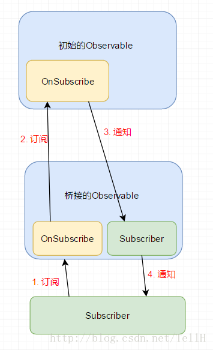

#[一起来造一个RxJava，揭秘RxJava的实现原理](https://blog.csdn.net/tellh/article/details/71534704)

## RxJava的**事件**都是普通的POJO对象
源码中可以看到就是用最普通的泛型做的定义，可以使用任何Java对象作为事件

##RxJava是如何实现操作符的呢？
其实，每调用一次操作符的方法，
就相当于在上层数据源和下层观察者之间桥接了一个新的Observable。
桥接的Observable内部会实例化有新的OnSuscribe和Subscriber。
OnSuscribe负责接受目标Subscriber传来的订阅请求，
并调用源Observable.OnSubscribe的subscribe方法。
源Observable.OnSubscribe将Event往下发送给桥接Observable.Subscriber，
最终桥接Observable.Subscriber将Event做相应处理后转发给目标Subscriber。
流程如下图所示：

看Transformer接口，这是一个函数式接口，定义了一个转换器
可以明白其实map操作符实现原理挺简单的啊，就是接收一个转换器（Transformer），
将操作**映射**到目标subscriber

map操作符的作用是将T类型的Event转化成R类型，
转化策略抽象成Transformer<T, R>（RxJava中用的是Func1<T, R>，
但为了便于理解，起了一个有意义的名字）这一个函数接口，由外部传入。

代码中使用到一些泛型的通配符，有些地方使用了super，有些地方使用了extends，
其实这是有讲究的，
传给Transformer#call方法的参数是T类型的，那么call方法的参数类型可以声明成是T的父类，
Transformer#call方法的返回值要求是R类型的，所以call方法的返回类型要声明为R的子类

